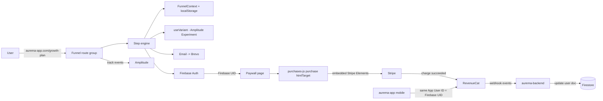

# 01 — Architecture

## High-level diagram



## Folder layout

```
aurema-web/
  src/
    app/
      (funnel)/
        growth-plan/
          layout.tsx          Chakra provider + FunnelProvider
          page.tsx            Redirect to first step
          [stepId]/page.tsx   Dynamic step renderer
          paywall/page.tsx    RC Web SDK checkout
          activate/page.tsx   Post-payment confirmation
      ...existing marketing routes untouched
    funnel/
      components/             StepShell, OptionText, OptionWithImage,
                              ProgressBar, AutoLoadingBar, ContinueButton,
                              FunnelHeader, GrowthPlanPolicy
      steps/                  One file per step
      flow/
        flow.ts               Ordered step list
        useFunnelNavigation.ts
      state/
        FunnelContext.tsx
        useFunnelAnswers.ts
        types.ts
      experiments/
        amplitudeExperimentClient.ts
        useVariant.ts
        experiments.constants.ts
      services/
        revenueCatClient.ts
        firebaseClient.ts
        brevoClient.ts
        funnelApi.ts
      analytics/
        track.ts              Typed Amplitude wrapper
      theme/
        chakraTheme.ts
      hooks/                  Shared funnel hooks
  docs/funnel/                This directory
  .cursor/rules/              Agent rules
  .cursor/skills/             Agent skills
```

## Data flow — answers

- `FunnelContext` holds `answers: FunnelAnswers` + `setAnswer(key, value)`.
- On every `setAnswer`, write to `localStorage` under `aurema.funnel.answers.v1`.
- On mount, read from `localStorage` and hydrate. If the version key doesn't match, discard (migration is cheap; we're pre-launch).

## Routing

- `/growth-plan` → redirect to `flow[0].id`.
- `/growth-plan/[stepId]` → resolve to `flow.find(s => s.id === stepId)`.
- `useFunnelNavigation` exposes `goNext()`, `goPrev()` computed against the `flow` array + `when` predicates.
- Paywall and activate are **not** dynamic step routes; they're their own pages so they can own their own layout.

## RevenueCat invariant

- `Purchases.configure(NEXT_PUBLIC_RC_WEB_PUBLIC_KEY, firebaseUid)` called exactly once, immediately after Firebase sign-in.
- Mobile (`aurema-app`) must also use Firebase UID as App User ID. This is enforced by convention; we'll write a unit test in phase 5 that checks a sample webhook payload and fails if `app_user_id` isn't a Firebase UID shape.

## Chakra decision

- **Chakra v3** is the target. React 19 compatibility confirmed; v2 had hooks issues that only landed in v3. Pin exact version at install time and document in `PROGRESS.md`.
- Theme at `src/funnel/theme/chakraTheme.ts`, color tokens only — no raw hex in components.
